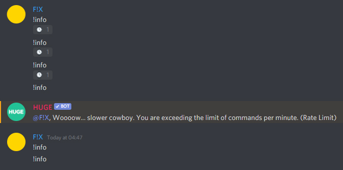

# RateLimiter 
Command Rate Limiter used by HUGE bot

## How to install?
You have two repositories available to download the library **JitPack** or **GitHub Maven Registry**.

### Gradle Implementation
```gradle
repositories {
    jcenter()
    
    // This one for Jitpack
    maven { url 'https://jitpack.io' }
    
    // This one for GitHub Maven Registry
    maven {
        url 'https://maven.pkg.github.com/Hugebot/RateLimiter'
        credentials {
            username = secrets["gpr.user"]
            password = secrets["gpr.key"]
        }
    }
}
```

```gradle
dependencies {
    implementation 'net.hugebot:RateLimiter:v1.0.0'
}
```

## Usage Example



Easy implementation ``(JDA)``:
```kotlin

class MyMessageListener : ListenerAdapter() {

    override fun onGuildMessageReceived(event: GuildMessageReceivedEvent) {
        // Get the user ID
        val userId = event.author.idLong
        
        // Ignore if the user has exceeded the limit ``(>45 events)``
        if (rateLimiter.isExceeded(userId)) return
        
        // Take an action if the user has reached the limit but has not yet exceeded it ``(==45 events)``
        if (rateLimiter.isRateLimited(userId)) return event.channel.sendMessage("<@!$userId>,  you are exceeding the limits...").queue()
        
        // Follow with the workflow
    }

    companion object {
        private val scheduler = Executors.newSingleThreadScheduledExecutor()
        
        // Creating a rate limiter with 45 events every 60 seconds
        private val rateLimiter = RateLimiter.Builder()
            // Set the events allowed
            .setQuota(45)
            // Set the expiration time
            .setExpirationTime(60, TimeUnit.SECONDS)
            // RateLimiter.Builder() creates it own threadpool but you can add your custom threadpool
            .withScheduledExecutor(scheduler)
            .build()
    }
}
```
